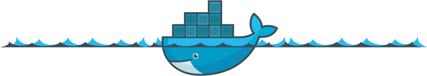
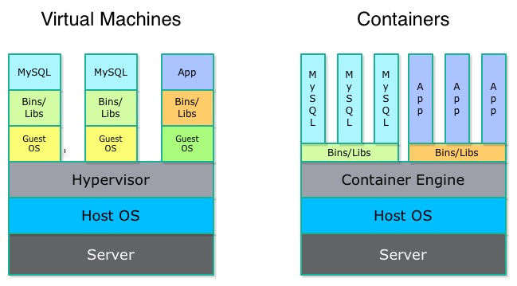
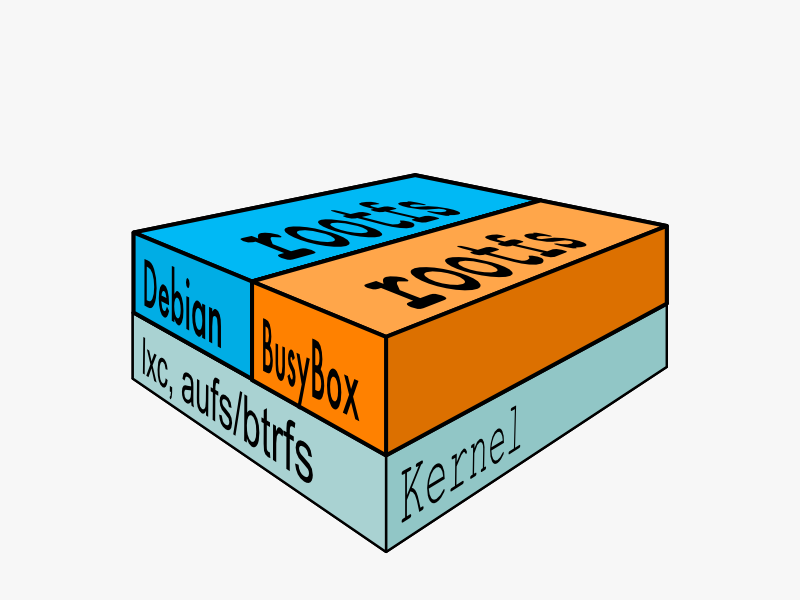

#### &nbsp;

# Docker

### 16-Dec-2014

----

## What is Dokker?

 &nbsp; 

----

<h2>What is Docker?</h2>

**`Docker`** builds on top of OS-level virtualization methods

for running multiple isolated **`Linux`** systems - **`containers`** -

on a single host system

 &nbsp; 

----

## What are Containers?

A **`container`** is a self contained execution environment

that shares the kernel of the host system and

which is isolated from other containers in the system

- - -

**Isolated resources**
 
{ CPU, memory, disk I/O, network, process IDs etc. }

----

## What are Containers?

Examples of containerization methods

[Linux Containers (LXC)](https://linuxcontainers.org/) | [OpenVZ](http://openvz.org/) | [Linux-VServer](http://linux-vserver.org/)

----

## Containers vs. Virtual Machines

**Virtual machines** | Hypervisor-based virtualization

**Containers** | OS-level virtualization

----

## Containers vs. Virtual Machines

&nbsp;

#### Virtual machines

Full OS for each VM

Any operating system

Fully dedicated resources (CPU, RAM, Disk)

- - -

#### Containers

Shared kernel providing isolated virtual environment

Any Linux distribution

Lightweight | Low overhead per container

----

## Docker Containers & Images

Enter Docker's layer system

--

## Filesystems

Linux requires 2 filesystems

--

## Multiple rootfs

Docker supports multiple rootfs

--

## Docker image

Read-only layers are called **`images`**

--

## Stacking images

Images can depend on other images called **`parents`**

--

## Docker container

On top of images Docker creates writable layers called **`containers`**

----

## Docker composition

&nbsp;

1. A **daemon** with a RESTful API
<pre># service docker start</pre>

1. A **command-line client** to build images and manage containers
<pre># docker build|images|run|ps|exec|start|stop|rm
# docker search|pull|push</pre>

1. Public and private Docker **image registries**
<pre>&raquo; <a href="https://registry.hub.docker.com/"">Docker Hub Registry</a></pre>

----

## Demo

1. Interactive container
1. Detached container
1. Versioned filesystem
1. Saving a container state to an image
1. Automated image build &laquo; Dockerfile

--

## 1. Interactive container

<pre><code class="bash"># start /bin/bash in a container | -i means interactive
$ sudo docker run --name demo -t -i ubuntu:14.04 /bin/bash
root@cbe84007dedc:/>

# look around all your processes / filesystem / network
root@cbe84007dedc:/> ps aux
root@cbe84007dedc:/> ls -l
root@cbe84007dedc:/> ifconfig

# exit - container is stopped as /bin/bash exits
root@cbe84007dedc:/> exit

# start container
$ sudo docker start demo
root@cbe84007dedc:/>

# detach/attach container
root@cbe84007dedc:/> Ctrl-p + Ctrl-q
$ sudo docker attach demo
root@cbe84007dedc:/>
</code></pre>

--

## 2. Detached container

<pre><code class="bash"># -d means detached
$ CID=$(sudo docker run -d ubuntu:14.04 \
  bash -c 'while true; do sleep 1; echo hello at $(date); done')

# show id of container
$ echo $CID

# show container's logs (stdout)
$ sudo docker logs -f $CID

# show running containers
$ sudo docker ps

# stop container
$ sudo docker stop $CID

# show all stopped and running containers
$ sudo docker ps -a

# remove container
$ sudo docker rm $CID</code></pre>

--

## 3. Versioned filesystem

<pre><code class="bash"># look at /tmp
$ sudo docker run ubuntu:14.04 /bin/ls -l /tmp

# modify the filesystem
$ CID=$(sudo docker run -d ubuntu:14.04 \
  bash -c 'while true; do sleep 1; echo "hello at $(date)" > /tmp/$(date +%Y%m%d_%H%M%S); done')

# see the changes on the filesystem
$ sudo docker diff $CID

# remove the container
$ sudo docker rm -f $CID

# create new container and look at /tmp
# changes are gone!
$ sudo docker run ubuntu:14.04 /bin/ls -l /tmp</code></pre>

----

## Docker @ Bonitasoft

 
 &nbsp; 
 
 &nbsp;  &nbsp; 
 
 &nbsp;  &nbsp; 

----

## Docker @ Bonitasoft

&nbsp;

- 5 Docker hosts with 2 **Jenkins** containers each
- 1 Docker host with 5 application containers

----

## Documentation

&nbsp;

<i class="fa fa-github-square"></i>&nbsp;&nbsp;[Docker for Bonitasoft CI on GitHub](https://github.com/bonitasoft/bonita-internal-tools/tree/master/ci/docker)

<i class="fa fa-google-plus-square"></i>&nbsp;&nbsp;[Docker on R&D Google site](https://sites.google.com/a/bonitasoft.com/rd/continuous-integration/docker)

&nbsp;

----

#### &nbsp;

# Thank you

#### &nbsp;

